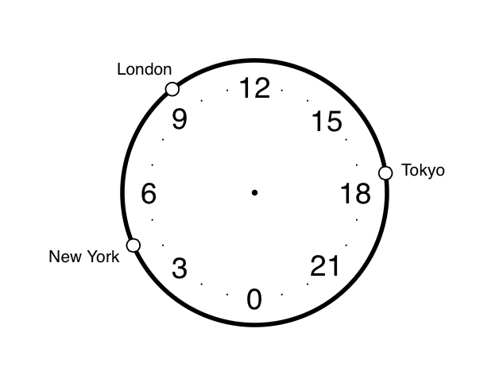

# Loclock

World time clock

[](https://www.ionstage.org/loclock/)

## Features
- Check local time in cities worldwide at one view.
- Support daylight saving time (DST).

## Running Locally
- Install [Node](https://nodejs.org/en/download/)
- Install the dependencies

```
npm install
```

Then run:

```
npm start
```

Works on IE11, Firefox, Safari, Chrome.


## License
Copyright &copy; 2015 iOnStage
Licensed under the [MIT License][mit].

[MIT]: https://opensource.org/licenses/mit-license.php
